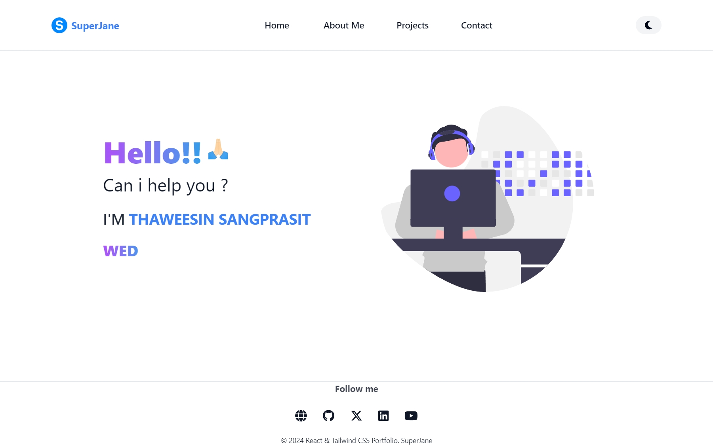
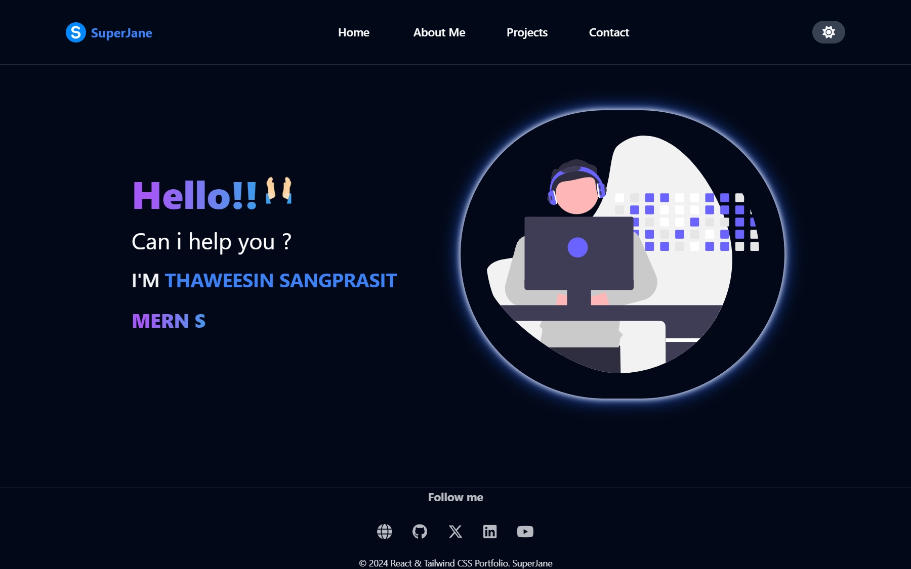

#  About Me V.2

**About Me V.2** is a personal porfolio website designed to showcase my skills, experiences, and projects. It features a modern, responsive layout and interactive elements to provide visitors with a seamless and engaging experiences.


# Table of contents

- **[Features](#feature)** 
- **[Technologies Used](#technologies-used)**
- **[Installation and Setup](#installation-and-setup)**
- **[Deployment](#deployment)**
- **[Folder Structure](#folder-structure)**
- **[Screenshots](#screenshots)**
- **[Contributions](#contributions)**
- **[License](#license)**
- **[Acknowledgments](#acknowledgments)**

## Feature

- **Responsive Design** : Optimized for destops, tables, and mobile devices.
- **Interactive Navigation** : Includes a smooth scrolling navigation bar with a toggle menu for mobile screen.
- **Theme Switcher** : Offers light and dark mode options.
- **Projects Section** : Hightlights personal and collaborative projects with dynamic filtering based on screen size.
- **Modern UI/UX** : Features animations, hover effects, and transitions for a poloshed look.
- **Performance Optimization** : Built with Vite and React for fast loading and efficiency.

## Technologies Used

- **React** : Component-based library for building user interfaces.
- **Tailwind CSS** : Utility-first CSS framework for responsive and clean styling.
- **React Router** : For managing navigation between pages.
- **Vite** : Lightning-fast build tool for development and production.
- **Netlify** : Continuous deployment and hosting platform.

## Installation and Setup

To run the project locally, follow these step:
1. Clone the repository:
	```bash
	git clone https://github.com/your-username/about-me-v2.git
	cd about-me-v2
	```
2. Install dependencies:
	```bash
	npm install
	```
3. Start the development server:
	```bash
	npm run dev
	```
4. Open your browser and navigate to `http://localhost:5173`.
	

## Deployment

The project is deployed on [netlify](https://www.netlify.com). To deploy:
1. Link your GitHub repository to your Netlify account.
2. Set the build command to:
	``` bash
	npm run build
	```
3. Set the publish directory to `dist`.
4. Deploy the site.


## Folder Structure

```
about-me-v2/
├── public/          # Static files (e.g., favicon.ico)
├── src/             # Source code
│   ├── assets/      # Images and other media assets
│   ├── components/  # Reusable React components
│   ├── pages/       # Page components
│   ├── App.jsx      # Main application component
│   └── main.jsx     # Entry point for React
├── package.json     # Project dependencies and scripts
├── tailwind.config.js  # Tailwind CSS configuration
├── vite.config.js   # Vite configuration
└── README.md        # Project documentation
```


## Screenshots

### Light Mode


### Dark Mode


## Contributions

Contributions are welcome !  If you'd like to add features or fix bugs:
1. Fork the repository.
2. Create a new branch:
	```bash
	git checkout -b feature-name
	```
3. Make your changes and commit them:
	```bash
	git commit -m "Description of changes"
	```
4. Push to your branch:
	```bash
	git push origin feature-name
	```
5. Open a pull request.

## License

This project is licensed under the MIT License. See the [LICENSE](LICENSE) file for details.

## Acknowledgments

- Thanks to the creators of React, Tailwind CSS, FontAwesome, React Hook From, DaisyUI and Vite for their amazing tools.
- Hosted by [Netlify](https://www.netlify.com).

